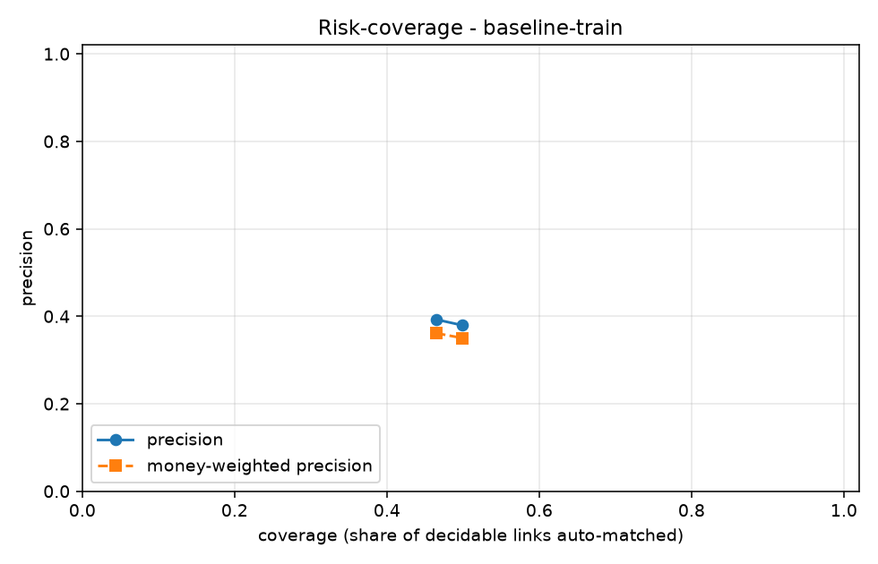

# LedgerLoop

Merchants reconcile PSP settlements against bank statements against their own ledger by
hand, and the cost is not the matching — it is verifying the matches nobody is sure about.

**LedgerLoop is a reconciliation system that knows when it is wrong.** The headline
artifact is not an accuracy number, it is a calibrated risk–coverage curve: the merchant
chooses where on that curve their risk appetite sits, and the system reports honestly on
everything it declines to decide.

> Razorpay AI Buildathon, Track 04 (AI Finance Controller). Build plan in [BUILD.md](BUILD.md).

---

## Metrics

<!-- METRICS:START -->
_Run `baseline-train` on `data/train`. Regenerated by `ledgerloop eval`; do not hand-edit._

| Metric | Value |
|---|---|
| Auto-match rate (coverage) | 49.87% |
| Precision on auto-matched | 37.96% |
| Recall of true links | 18.93% |
| Money-weighted precision | 35.0399% |
| Money error ratio (Rs wrong / Rs at stake) | 34.5009% |
| Orphan refusal rate | 100.00% |
| Rs at stake | 395,349,148.43 |
| Rs incorrectly matched | 136,398,989.46 |
| False auto-matches | 1530 |
| Risk-coverage curve points | 2 |

**Per-case-type**

| case_type | total | matched | missed | refused |
|---|---|---|---|---|
| `batched_settlement` | 659 | 99 | 560 | 0 |
| `clean` | 3022 | 609 | 2413 | 0 |
| `date_skew` | 165 | 35 | 130 | 0 |
| `duplicate_utr` | 110 | 22 | 88 | 0 |
| `fee_deducted` | 549 | 97 | 452 | 0 |
| `orphan` | 55 | 0 | 0 | 55 |
| `partial_payment` | 330 | 62 | 268 | 0 |
| `rounding_drift` | 110 | 12 | 98 | 0 |
<!-- METRICS:END -->

---

## Status

Phase 2 of 8 complete. The table above is the exact-UTR-only **baseline** - the
regression floor, not a result. Any real matcher must beat it.

| Phase | Scope | State |
|---|---|---|
| 0 | Scaffold, Compose, schema, isolation lint | ✅ complete |
| 1 | Synthetic generator, real schemas, held-out design | ✅ complete |
| 2 | Eval harness, risk–coverage curve | ✅ complete |
| 3 | Blocking, exact and fuzzy matching | pending |
| 4 | Classifier, calibration, selective prediction | pending |
| 5 | LLM exception layer, audit trail | pending |
| 6 | API, frontend, chaos mode | pending |
| 7 | Sealed test set, held-out results, failure analysis | pending |
| 8 | README, video, rehearsal | pending |

### Risk-coverage curve



The headline artifact: precision as a function of how much the system chooses to decide.

The baseline's curve has exactly **two points**, and the trade-off between them is real
but far too coarse to choose an operating point from:

| threshold | coverage | precision | money-weighted | false matches |
|---|---|---|---|---|
| 1.0 (amount agrees) | 48.41% | **100.00%** | 100.0000% | 0 |
| 0.7 (UTR only) | 51.71% | 97.85% | 97.9156% | 55 |

Buying 3.3 points of coverage costs 2.15 points of precision, and there is nothing in
between - a merchant who wants 60% coverage, or who wants to know the precision at 70%,
gets no answer at all. That is the argument for Phase 4: a calibrated classifier turns
two points into a curve you can actually select from.

## Architecture

Four layers, in strict order. **Nothing reaches a layer that an earlier one could settle.**

```
deterministic  ->  probabilistic  ->  learned  ->  generative
exact rules        fuzzy matching     classifier   LLM
(UTR + amount)     (RapidFuzz,        (LightGBM,   (parse, propose,
                    subset-sum)        calibrated)  explain — never decide)
```

The LLM never decides a match. It parses unstructured narration, proposes journal
entries, and writes exception reasons. Match/no-match is always a scored decision from
the deterministic or learned layers, because this is a financial control and generation
is not adjudication.

## Running it

Docker Compose is the primary run path, not an optional extra.

```
copy .env.example .env
docker compose up
```

Three services come up: `db` (PostgreSQL 16), `api` (FastAPI on :8000), `web` (:3000).
Migrations apply automatically on `api` start, and the API will not start until Postgres
passes its healthcheck.

### CLI

The Typer CLI is the canonical interface — there is no Makefile, and every path works on
Windows.

```
ledgerloop generate --rows 1000 --seed 42 --difficulty hard --out data/train
ledgerloop recon --in data/train --mock-llm
ledgerloop eval --run RUN_ID
ledgerloop chaos --run RUN_ID --corruption unseen_narration
```

`--mock-llm` runs the entire pipeline with no API key. Every phase before Phase 5 depends
on this working.

### Local development

```
python -m venv venv
venv\Scripts\activate
pip install -r requirements-dev.txt
pip install -e . --no-deps
pytest
```

## The isolation boundary

`datagen/` produces the synthetic data **and** the ground-truth answer key.

`core/`, `model/`, `llm/` and `api/` must never import from `datagen/`, read `truth.csv`,
or depend on any generator internal. The matcher sees exactly what a real system would
see: three files of records. Only `evals/` may read both sides, and only to score
predictions after the fact.

If the matcher can see the answer key, every number here is worthless — so this is
enforced by `tests/test_import_lint.py`, which fails the build on a breach.

## Data integrity

- **Money is `NUMERIC(14,2)`.** Never float. `tests/test_no_float_money.py` walks the
  schema and fails the build if a float column ever appears.
- **`audit_records` is append-only.** No update or delete path exists in code, and a
  Postgres trigger raises on UPDATE or DELETE so the guarantee holds against raw SQL.

## What it gets wrong

Populated in Phase 7 from `notes/failure-modes.md`. The honest list is part of the
submission, not an appendix to it.
